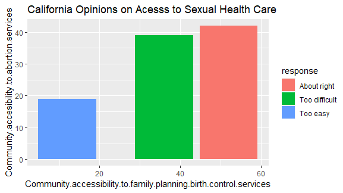
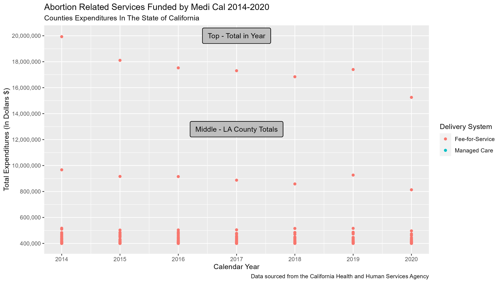

```{r setup, include=FALSE}
knitr::opts_chunk$set(echo = TRUE, warning=FALSE, message=FALSE)
library(knitr)
options(scipen=999)
```


```{r echo=FALSE}
source("../source/calculate_summary.R")
min_legalize_prop <- min(merged_table[1:5]) * 100
avg_total_exp <- merged_table[6]
time_8 <- merged_table[7]
time_12 <- merged_table[8]
time_16 <- merged_table[9]
time_20 <- merged_table[10]
```

## Summary Information
Our data works with points about public opinion of abortions, cost of abortions, and driving times to abortion clinics in California state. From the first five columns, the table reveals that over `r min_legalize_prop`% of Californian survey participants consistently agree that abortions should be legalized under various conditions. This observation affirms our own opinions on California's liberal views that make them more likely to agree to legalizing abortions. <br> The sixth column took the average of all total expenditures on abortions and abortion-related procedures per county in California, and this result came out to $`r avg_total_exp`. We acknowledge that California is a large state with many large cities and also many rural cities, which was shown in our original dataset with millions of dollars from major counties like Los Angeles County, whereas abortions and abortion-related services were only a few hundred dollars in the smaller, rural counties like Sierra County. <br> The last four columns in our table describe one's average driving time (in minutes) to the nearest abortion clinic in California, based on what week of pregnancy they decided to abort at (8, 12, 16, 20). These numbers came out to be very small (all around 1 minute: `r time_8`, `r time_12`, `r time_16`, and `r time_20`, respectively), and we believe this is because there is an abundance of clinics in California that are more easily accessible to serve more of the state's extremely large population. Though small, there was a positive trend in the driving time as one's pregnancy progressed until they decided to get an abortion. We believe this is because it becomes increasingly more difficult to perform abortions later in the pregnancy, and not all clinics would have the capacity or skill to handle those abortions, so people would have to drive farther out to find an abortion clinic that serves them. 


### Our table of aggregated data, grouping by the state of California.  
```{r echo=FALSE}
source("../source/summary_table.R")
# split table into two sections for readability
kable(merged_table[1:5], caption = "Public opinions on abortions in California: proportions in favor of legalizing")
kable(merged_table[6:10], caption = "Average cost of abortions in California and average driving times to abortion clinics")
```
When wrangling with our datasets, we noticed that Dataset 1 was about public opinions on abortions across all **US states**, Dataset 2 was only about **California counties**, and Dataset 3 had **cities across the United States**. Since our datasets were so diverse, decided to aggregate our data based on the state of California, thus creating a table with the most important points from each dataset with information about abortions in California. We acknowledge that the information from each dataset was collected from different numbers of people, so we made sure to specify that in our column titles. As a summary of our table, our first five columns show the proportions of California survey participants who agree that abortions should be legal under various circumstances, from December 2019. The sixth column describes the average amount of money spent in a county on abortions and abortion-related procedures, across 2014-2020. The last four columns describe the average driving time it takes a California resident to travel to an abortion clinic at 8, 12, 16, and 20 weeks along in their pregnancy to receive an abortion. This showed an increasing trend as the length of pregancy progressed. 

---

### Dataset 1: Abortion Knowledge and Attitudes Poll (Dec 2019, Kaiser Family Foundation)
```{r echo=FALSE, fig.width=8, fig.height=4, fig.cap="Source: Henry J. Kaiser Family Foundation for Roper Center at Cornell University"}
source("../source/dataset3_graph.R")

```



Most of the California residents would alter in some way the level of accessibility to abortion services, as well as family planning & birth control services. As well, California residents responses vary the most when asked if abortion should be legal or illegal if the patients life in endangered. In California, the amount of residents who believe accessibility to family planning & birth control services is about right, is near the amount who also believe accessibility to abortion services is too difficult. Revealing there may be a disparity in the amount of resources for accessible abortion services in California. Although California residents opinion reflected that abortion should be legal in most cases, the gap between responses begins to close when asked “Should abortion be legal or illegal for women who do not wish to be pregnant.”

---

### Dataset 2: Abortion-Related Services Funded by Medi-Cal (2014-2020, Medi-Cal)
 

 
---
 
### Dataset 3: Driving Times to Abortion Clinics in the US (Aug 2017, The Pudding)
```{r echo=FALSE, fig.width=8, fig.height=4, fig.cap="Source: The Pudding (MIT)"}
source("../source/dataset3_graph.R")
line_graph
```
I included this chart because I thought it was interesting to see the changes in driving times it takes to arrive to abortion clinics that will serve someone who's pregnant along that many weeks in their pregnancy. It reveals that travel time increases as one is farther along in their pregnancy. We believe this is because it may be harder for certain clinics to perform more risky operations, so people may have to travel farther to seek a clinic that will serve them. We observed that this time was very small among all weeks of pregnancy - around 1 minute - and think that this is because of how large of a state California is, so there is possibly a larger number of clinics to make health services more accessible to all residents, which would decrease travel time. The aforementioned data is shown in the double line graph as the solid line. The dotted line shows average driving time to the next closest abortion clinic if someone's closer clinic is closed. This confirmed our assumptions that travel time would increase overall because people would have to travel farther. We chose to display this information in a double line graph to show the difference in time between traveling to the closest clinic/second closest clinic, as well as how the trend unfolds as the length of pregnancies increase. 
